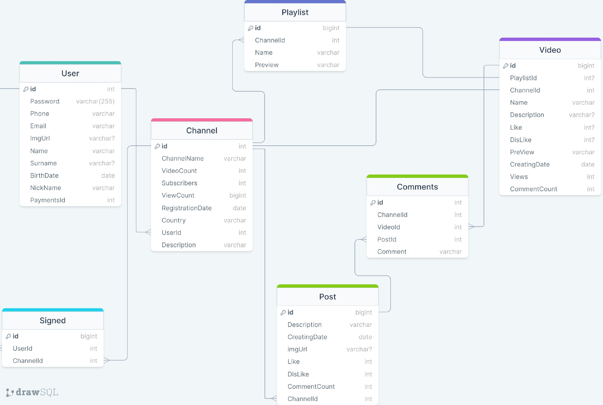
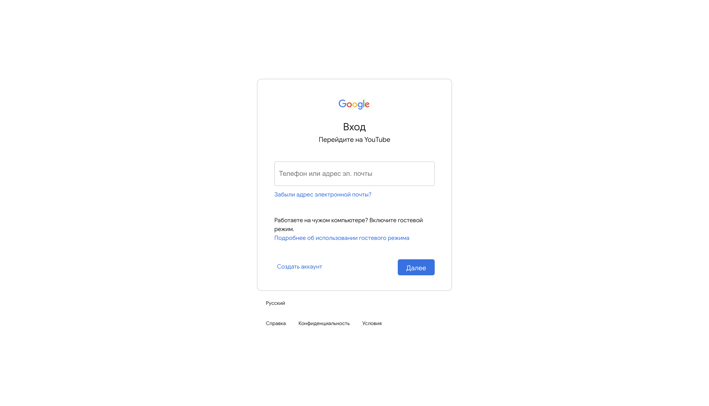
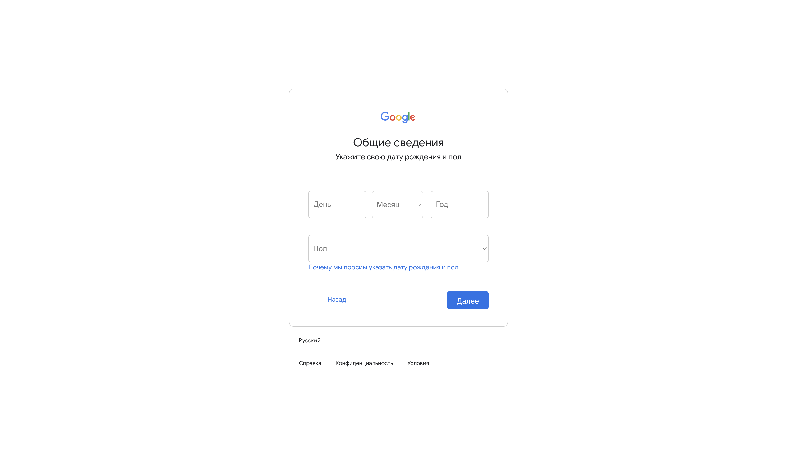
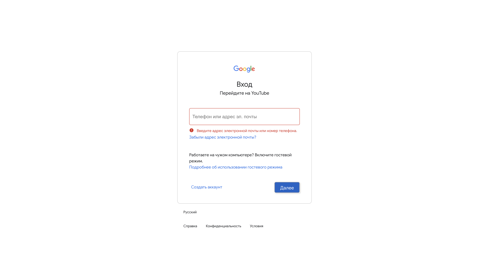
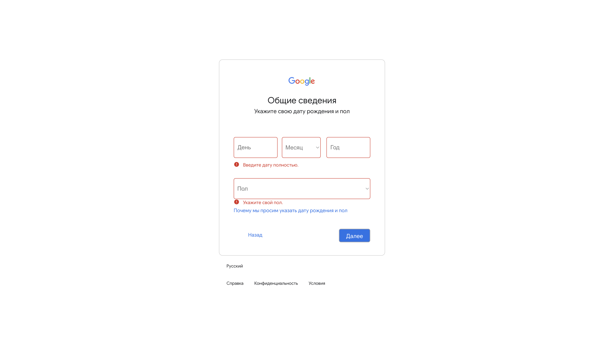

## Postgres Docker

```bash
docker run --name youtube-pg -p 5460:5432 -e POSTGRES_PASSWORD=youtube -d postgres:13.3
```

## Первый спринт 

1) Главная страница

2) Спроектированная база данных

3) Авторизация и регистрация (бэк)

4) Страница для авторизации/регистрации (фронт)

5) Валидация данных (фронт)

## Главная страница

Видео берутся из `YouTube API`, бокове меню на кнопку можно скрыть, также сделано дополнительное меню для пользоваетля при нажатии на иконку с аватаркой.

 
<br></br>
 

## База данных

 

## Страница авторизации/регистрации

При нажатии на кнопки `далее/продолжить` и успешном прохождении валидации данных, будет меняться содержимое контейнера. В случае ошибки, форма высвечивается красным цветом с соответствующим сообщением об ошибке. Также был сделан роутинг отдельно для регистрации и отдельно для авторизации.

 
<br></br>
 
<br></br>
 
<br></br>
 
