## Содержание

- [CI status](#ci-status)
- [Как запускать Flutter приложение](#как-запускать-flutter-приложение)
- [GraphQL](#graphql)
  - [Формат идентификаторов](#формат-идентификаторов)
  - [Структура ответов](#структура-ответов)
- [Запросы](#запросы)
  - [1. Получение информации о канале](#1-получение-информации-о-канале)
  - [2. Получение подписок на каналы пользователя (список каналов, на которые подписан)](#2-получение-подписок-на-каналы-пользователя-список-каналов-на-которые-подписан)
  - [3. Получение информации о пользователе](#3-получение-информации-о-пользователе)
  - [4. Получение ID канала пользователя](#4-получение-id-канала-пользователя)
  - [5. Получение информации о кошельке пользователя](#5-получение-информации-о-кошельке-пользователя)
  - [6. Получение информации о видео](#6-получение-информации-о-видео)
  - [7. Получение списка видео с пагинацией](#7-получение-списка-видео-с-пагинацией)
- [Мутации](#мутации)
  - [1. Создание кошелька пользователя](#1-создание-кошелька-пользователя)
- [Этап 2 (Flutter)](#этап-2-flutter)
  - [Главная](#главная)
  - [Плеер](#плеер)
  - [Подписки](#подписки)
  - [Профиль](#профиль)
  - [YouTube Premium (для оплаты)](#youtube-premium-для-оплаты)
  - [Авторизация/регистрация](#авторизациярегистрация)
- [Как запускать проект в Docker](#как-запускать-проект-в-docker)
- [Запуск тестов для всего проекта](#запуск-тестов-для-всего-проекта)


## CI status


[](https://codecov.io/gh/a1unade/YouTube.NET)


[](https://codecov.io/gh/a1unade/YouTube.NET) 


## Как запускать Flutter приложение

Перед стартом мобильного приложения необходимо поднять backend в Docker => [гайд](#как-запускать-проект-в-docker).

Flutter приложение не хочет 'дружить' с сервером в Docker на `localhost`, поэтому все работает только на веб-версии, команда для запуска:

```bash
    flutter run -d chrome --web-hostname=localhost --web-port=5000
```

> Основные запросы сделаны на `graphql` через блоки и сервисы, авторизация/регистрация на `http.post` и моделями для ответов, дополнительно прикручен провайдер => `AuthProvider`.

## GraphQL

API позволяет получать и управлять данными пользователей, каналов, видео и кошельков через GraphQL запросы и мутации.

### Формат идентификаторов
- Все сущности идентифицируются UUID в виде строки.

### Структура ответов
- Все запросы возвращают поля `isSuccessfully` (булево), `message` (текст) для статуса операции.
- Для пагинации используются параметры `page` (номер страницы) и `size` (размер страницы).

---

## Запросы

### 1. Получение информации о канале

```graphql
query {
  channel(id: "ab8d5a29-0e4d-4c16-98d3-0ef95e858ad2") {
    channel {
      id             # UUID канала
      name           # Название канала
      subscribers    # Количество подписчиков
      videoCount     # Количество видео на канале
      description    # Описание канала
      mainImage      # Идентификатор основного изображения (аватар)
      bannerImage    # Идентификатор баннера канала
    }
  }
}
```

Пример успешного ответа

```graphql
{
  "data": {
    "channel": {
      "channel": {
        "id": "ab8d5a290e4d4c1698d30ef95e858ad2",
        "name": "Tamaev TV",
        "subscribers": 231232,
        "videoCount": 1,
        "description": "Это моя машина",
        "mainImage": "87be5e57-f447-4b07-aa77-df4f56eabe8e",
        "bannerImage": "00000000-0000-0000-0000-000000000000"
      }
    }
  }
}
```

### 2. Получение подписок на каналы пользователя (список каналов, на которые подписан)

```graphql
query {
  subsChannel(id: "f73f9ccd-bea8-4bc1-a3b6-01106ef9c997", page: 1, size: 10) {
    isSuccessfully  # Статус запроса (true/false)
    message        # Сообщение об ошибке или успехе
    channels {     # Массив каналов, на которые подписан пользователь
      id
      name
      description
      subscribers
      videoCount
      bannerImage
      mainImage
    }
  }
}
```

Пример успешного ответа

```graphql
{
  "data": {
    "subsChannel": {
      "isSuccessfully": true,
      "message": null,
      "channels": [
        {
          "id": "ab8d5a290e4d4c1698d30ef95e858ad2",
          "name": "Tamaev TV",
          "description": "Это моя машина",
          "subscribers": 231232,
          "videoCount": 1,
          "bannerImage": "",
          "mainImage": "87be5e57-f447-4b07-aa77-df4f56eabe8e"
        }
      ]
    }
  }
}
```

### 3. Получение информации о пользователе

```graphql
query {
  user(id: "1fd36336-44ad-4cc9-9619-12c639c0f6a4") {
    isSuccessfully  # Статус запроса
    message        # Сообщение об ошибке или успехе
    name           # Имя пользователя
    surName        # Фамилия пользователя
    email          # Email пользователя
    userName       # Полное имя / Никнейм
    isPremium      # Статус премиум-подписки (true/false)
    channelId      # UUID канала пользователя
  }
}
```

Пример успешного ответа

```graphql
{
  "data": {
    "user": {
      "isSuccessfully": true,
      "message": null,
      "name": "Bulat",
      "surName": "Nagimullin",
      "email": "bulatfri18@gmail.com",
      "userName": "Bulat Nagimullin",
      "isPremium": false,
      "channelId": "f73f9ccdbea84bc1a3b601106ef9c997"
    }
  }
}
```

### 4. Получение ID канала пользователя

```graphql
query {
  userChannel(id: "1fd36336-44ad-4cc9-9619-12c639c0f6a4") {
    isSuccessfully  # Статус запроса
    message        # Сообщение, например, с ID канала
    entityId       # UUID канала пользователя
  }
}
```

Пример успешного ответа

```graphql
{
  "data": {
    "userChannel": {
      "isSuccessfully": true,
      "message": "User channel id: f73f9ccd-bea8-4bc1-a3b6-01106ef9c997",
      "entityId": "f73f9ccdbea84bc1a3b601106ef9c997"
    }
  }
}

```

### 5. Получение информации о кошельке пользователя

```graphql
query {
  userWallet(id: "0de80c01-b72e-47ce-b864-b9479ce57feb") {
    entityId      # UUID кошелька
    balance       # Баланс на кошельке (float)
    isSuccessfully # Статус запроса
    message      # Сообщение об ошибке или успехе
    walletId     # Идентификатор кошелька (UUID)
  }
}
```

Пример успешного ответа

```graphql
{
  "data": {
    "userWallet": {
      "entityId": "0de80c01b72e47ceb864b9479ce57feb",
      "balance": 100.5,
      "isSuccessfully": true,
      "message": null,
      "walletId": "f37b7c932b0d486c9aacda7f0bbcd4e4"
    }
  }
}
```

### 6. Получение информации о видео

```graphql
query {
  video(id: "2632bd2f-4db9-4d52-8cf7-18b9d10b05d4") {
    isSuccessfully   # Статус запроса
    channelId       # UUID канала, которому принадлежит видео
    videoId         # UUID видео
    video {         # Объект с деталями видео
      videoFileId   # UUID файла видео
      previewId     # UUID превью видео
      viewCount     # Количество просмотров
      name          # Название видео
      realiseDate   # Дата публикации
      channelName   # Название канала
    }
  }
}
```

Пример успешного ответа

```graphql
{
  "data": {
    "video": {
      "isSuccessfully": true,
      "channelId": "ab8d5a290e4d4c1698d30ef95e858ad2",
      "videoId": "2632bd2f4db94d528cf718b9d10b05d4",
      "video": {
        "videoFileId": "5a691bd70f67497395e95548bdd6e156",
        "previewId": "a7774f38c7424e1c9df9ea48e28a8e1b",
        "viewCount": 1245,
        "name": "Mohito",
        "realiseDate": "2025-01-04",
        "channelName": "Tamaev TV"
      }
    }
  }
}
```

### 7. Получение списка видео с пагинацией

```graphql
query {
  videoPagination(page: 1, size: 10) {
    isSuccessfully  # Статус запроса
    message        # Сообщение об ошибке или успехе
    videos {       # Массив видео с деталями
      previewUrl       # UUID превью картинки
      channelImageUrl  # UUID картинки канала
      videoName        # Название видео
      views            # Количество просмотров
      releaseDate      # Дата публикации
      videoId          # UUID видео
      channelId        # UUID канала
    }
  }
}
```

Пример успешного ответа

```graphql
{
  "data": {
    "videoPagination": {
      "isSuccessfully": true,
      "message": null,
      "videos": [
        {
          "previewUrl": "a7774f38-c742-4e1c-9df9-ea48e28a8e1b",
          "channelImageUrl": "87be5e57-f447-4b07-aa77-df4f56eabe8e",
          "videoName": "Mohito",
          "views": 1245,
          "releaseDate": "2025-01-04",
          "videoId": "2632bd2f4db94d528cf718b9d10b05d4",
          "channelId": "ab8d5a290e4d4c1698d30ef95e858ad2"
        }
      ]
    }
  }
}
```

## Мутации

### 1. Создание кошелька пользователя

```graphql
mutation {
  createWallet(
    id: "0de80c01-b72e-47ce-b864-b9479ce57feb",
    balance: 100.50
  ) {
    isSuccessfully  # Статус операции
    message        # Сообщение о результате
    entityId       # UUID созданного кошелька
  }
}
```

Пример успешного ответа

```graphql
{
  "data": {
    "createWallet": {
      "isSuccessfully": true,
      "message": "Wallet created successfully id: b610e492-93bd-4cd2-a0b6-f1f9884fd3f4",
      "entityId": "0de80c01b72e47ceb864b9479ce57feb"
    }
  }
}
```

## Этап 2 (Flutter)

Страницы:

1) Главная (список с видео)

2) Плеер

3) Подписки

4) Профиль

5) YouTube Premium (+ 2 модалки-заглушки)

6) Авторизация и регистрация

### Главная 

Открывается при запуске приложения, попасть можно через нижний навбар:

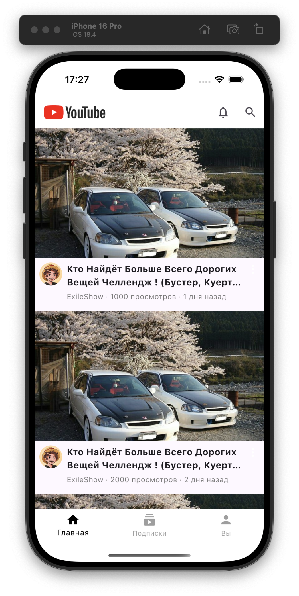

При нажатии на видео откроется страница плеера

### Плеер

Для плеера использовали готовое [решение](https://pub.dev/packages/video_player).

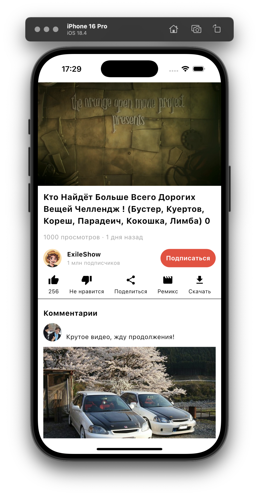

### Подписки

Экран с каналами, на которые подписан пользователь, попасть можно через нижний навбар.

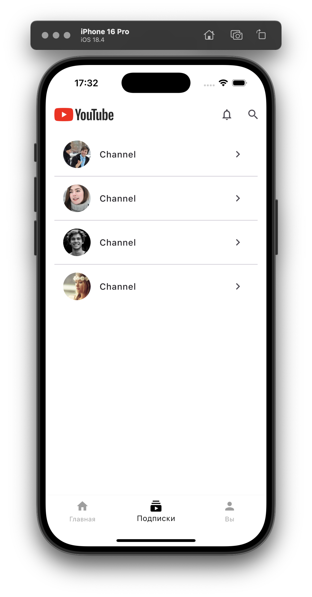

### Профиль

Экран профиля пользователя, при выходе из аккаунта на странице будет показано соотвествующее сообщение, с возможностью перехода на экран авторизации.

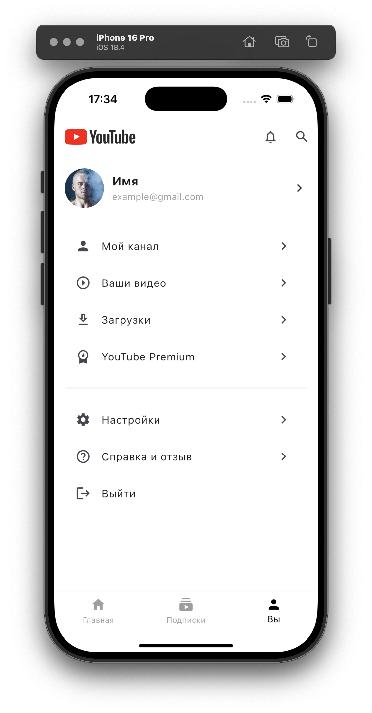

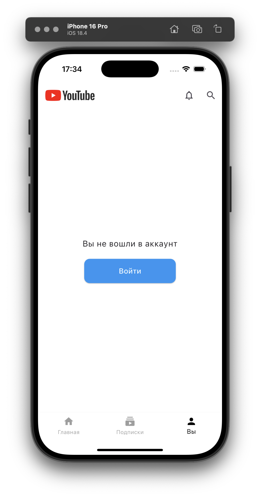

### YouTube Premium (для оплаты)

Страница с описанием фич подписки, плюс две модалки-заглушки, которые будут использованы для пополнения баланса и покупки подписки

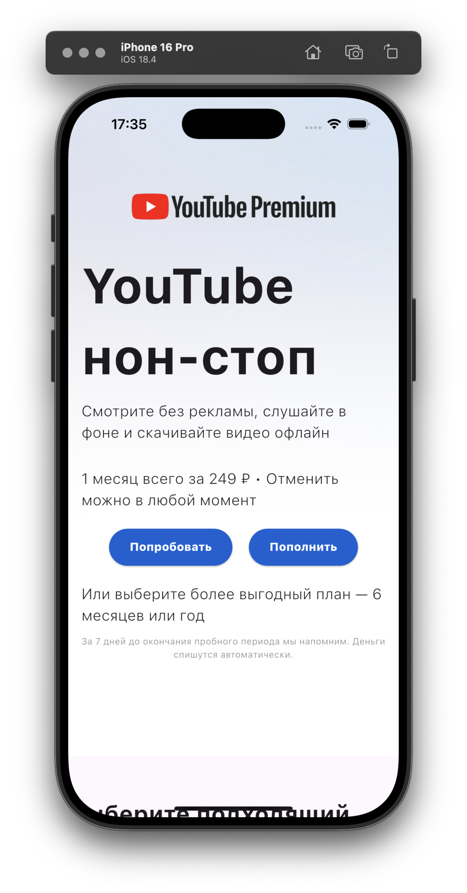

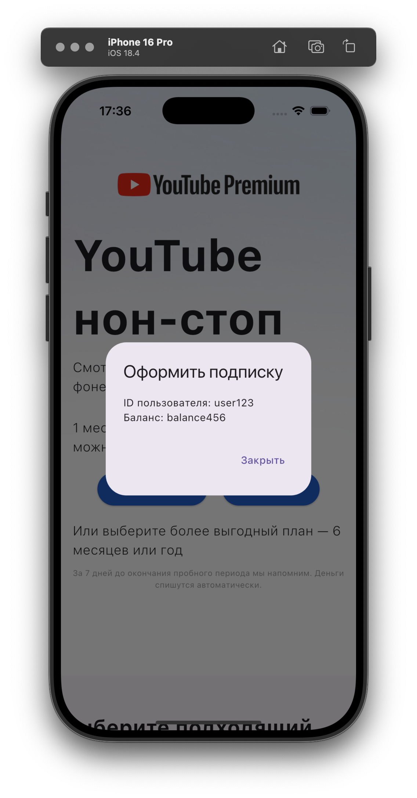

### Авторизация/регистрация

Экраны для авторизации/регистрации без валидации, просто макеты, для входа в аккаунт/регистрации достаточно просто нажать на кнопку

После входа/регистрации - редирект на экран профиля, делали регистрацию с помощью провайдера, вынесли его отдельно, для отслеживания состояния пользователя (авторизован или нет, нужно на экране профиля)

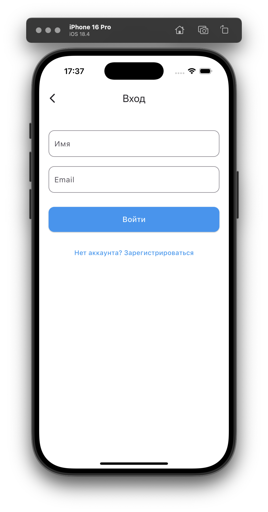

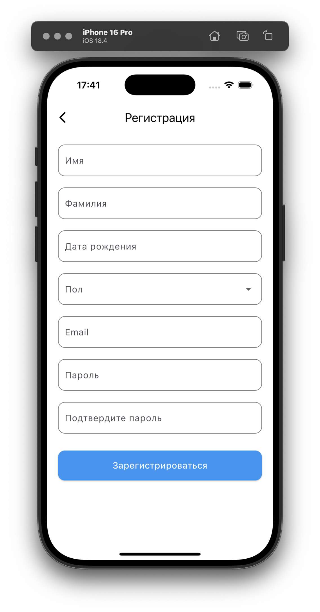

## Как запускать проект в Docker

В корневой папке нужно ввести команду ```make docker```, чтобы поднять все контейнеры.

Если `Makefile` не установлен: 

```bash
    docker:  
		docker-compose -f frontend/docker-compose.yml down --rmi all -v
		docker-compose -f frontend/docker-compose.yml up --build -d
		docker-compose -f backend/Youtube/docker-compose.yml down --rmi all -v
		docker-compose -f backend/Youtube/docker-compose.yml up --build -d

    tests:  
            cd frontend/youtube-frontend && npm install
            cd frontend/youtube-accounts && npm install
            cd frontend/youtube-frontend-tests && npm install && npm run test

            cd backend/Youtube && dotnet test --no-build --verbosity normal --collect:"XPlat Code Coverage" --settings ../../.github/coverlet.runsettings

    docker-backend:  
            docker-compose -f backend/Youtube/docker-compose.yml down --rmi all -v
            docker-compose -f backend/Youtube/docker-compose.yml up --build -d
```
> Чтобы поднять бэкенд

В результате должен быть примерно такой вывод: 

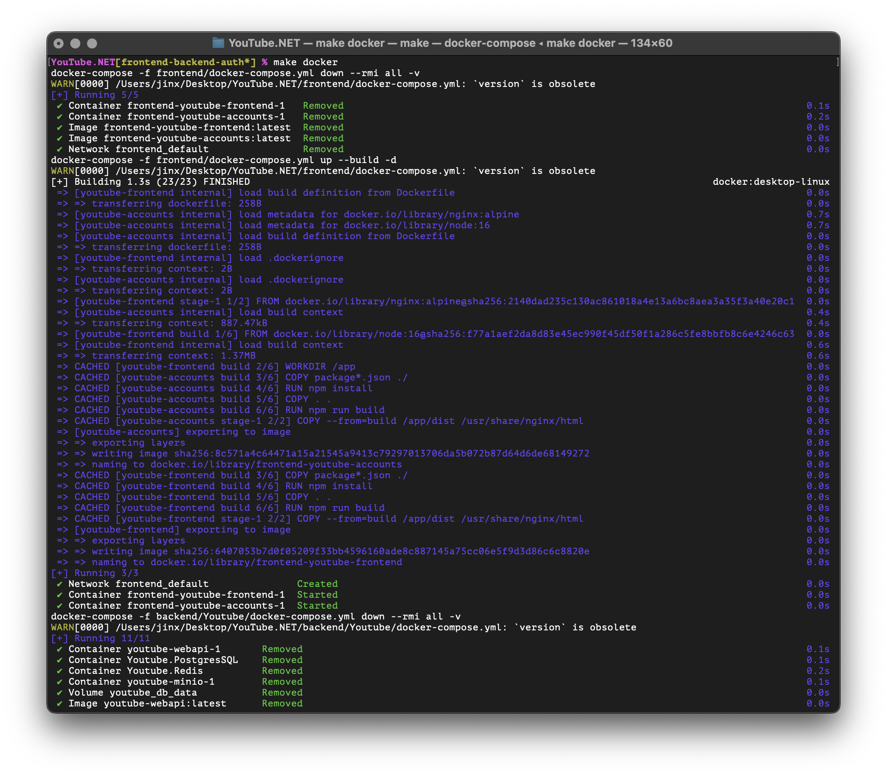

## Запуск тестов для всего проекта

В корневой папке нужно ввести команду ```make tests```. Запустятся тесты как для фронтенда, так и для бэкенда.

В консоли должен появиться такой вывод с результатми тестов:

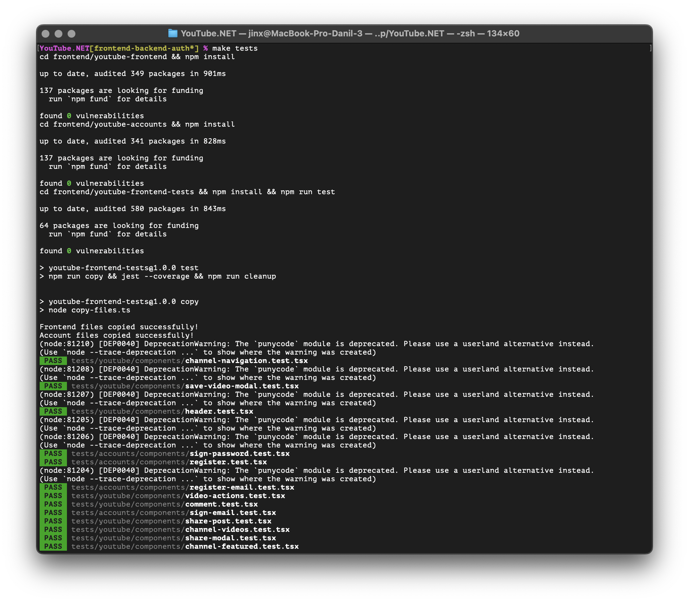